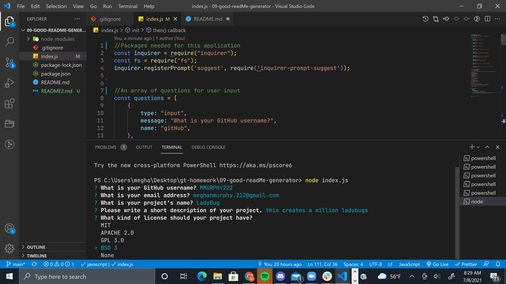
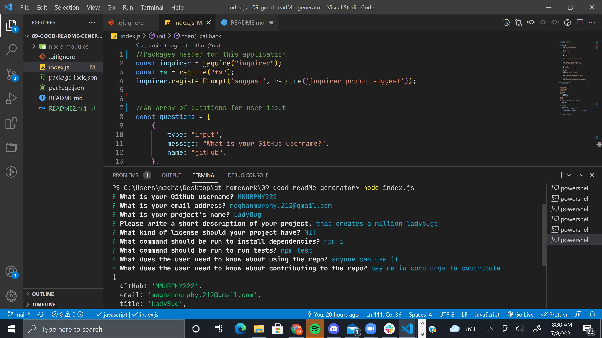
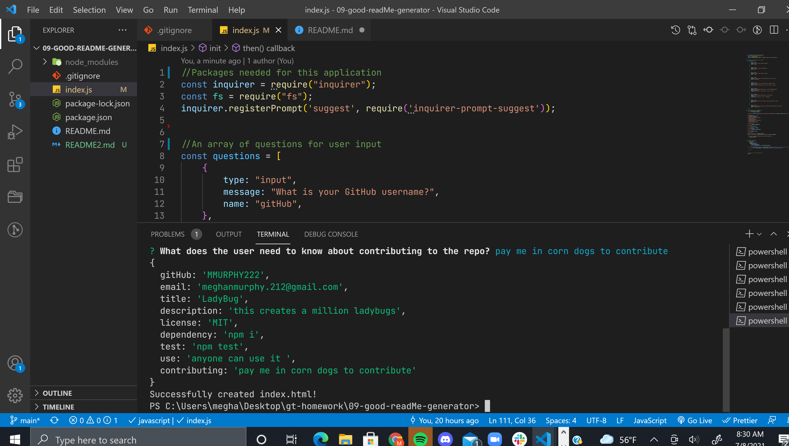
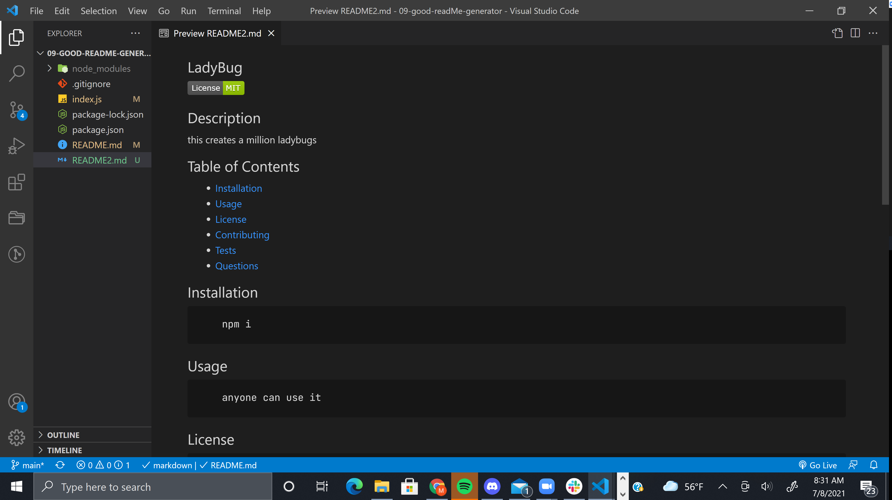
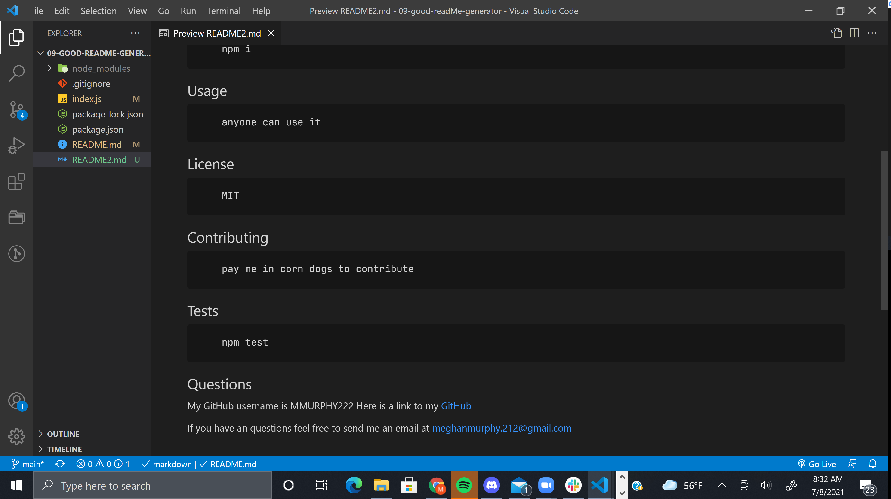

## 09 Good README.md generator

## User Story

```md
AS A developer
I WANT a README generator
SO THAT I can quickly create a professional README for a new project
```
## Description

```md
This is a command line application that accepts user input and generates a README.md based on that input. 
```

## Functionality
```md
Upon running node index.js in the command link the user will be prompted will multiple questions that require their input - most take a simple typed input, there is also a list, and a suggestion type which allows users to tab through pre selected choices. In the suggestion type users also have the option to type their own input over this options. 

The function run on initialization includes the inquirer prompt. It looks like this. 
```
```js
function init() {
    inquirer
    .prompt(questions)
    .then((answers) => {
        console.log(answers)
        const readMePageContent = writeToFile(answers);

        fs.writeFile('README2.md', readMePageContent, (err) =>
            err ? console.log(err) : console.log('Successfully created index.html!')
        );
    });
}
```

```md
It functions by passing the array questions into the prompt and then sets the function to a const to allow it to be passed into fs.writeToFile. The writeToFile function is a one line function of a large string containing all of the README.md and markdown syntax.
```
```md
The writeToFile function is where the functionality of the table of contents is added. 
```
```javascript
- [Installation](#installation)
- [Usage](#usage)
- [License](#license)
- [Contributing](#contributing)
- [Tests](#tests)
- [Questions](#questions)
```

```md
It appears like this in the string and this allows users to click and be taken to that section of the page. 
```
## Link to video

https://drive.google.com/file/d/1tiCYNY2-jplmzZHvyzaYASynOsxLGnNO/view
## Screenshots

Here are screenshots of the terminal view as input is received 







Here are screenshots of the generated README.md with the user input





